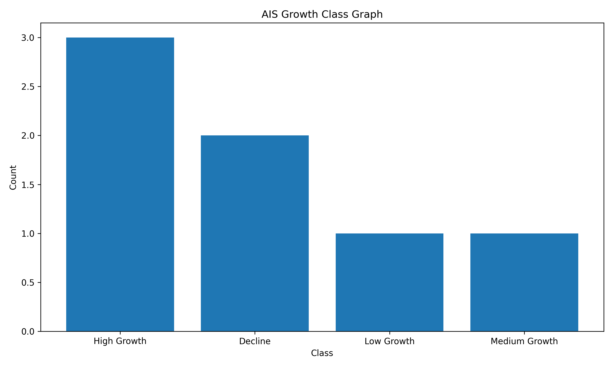

# 🚔 Juvenile Crime Growth Prediction System

## 🧠 Juvenile Crime Growth Prediction using Bio-Inspired Optimization Algorithms and Machine Learning

---

## 👤 Author

**Sagnik Patra**

---

## 📌 Project Overview

This project builds an end-to-end **Juvenile Crime Growth Prediction System** using **bio-inspired optimization algorithms**, machine learning, and predictive analytics.

The system uses historical juvenile crime statistics from `Table_30_1976.csv`, performs crime-growth feature engineering, applies intelligent feature selection using optimization algorithms such as **AIS**, **CSA**, and **PSO**, predicts juvenile crime growth rates, classifies crime growth categories, and automatically generates reports, graphs, prediction files, trained models, configuration files, and result summaries.

The project supports optimized feature selection and predictive modeling to assist researchers, policymakers, criminologists, and public administration departments in understanding juvenile crime trends and forecasting future crime growth patterns.

---



---

## 🎯 Objectives

- Analyze historical juvenile crime statistics
- Predict juvenile crime growth rates using machine learning
- Classify crime growth categories
- Apply bio-inspired feature selection algorithms
- Train machine learning prediction models
- Generate juvenile crime growth prediction reports
- Save trained models for future prediction
- Generate accuracy graphs, comparison graphs, and heatmaps
- Create a complete reproducible crime analytics pipeline

---

## 📂 Dataset Used

```text
Table_30_1976.csv
```

### Dataset Attributes

- Year
- Population in Millions
- Total Cognizable Crime Cases under IPC
- Total Juvenile Crime Cases under IPC
- Percentage of Juvenile Crime to Total Crime
- Volume of Juvenile Crime per Lakh Population

---

## 🔬 Bio-Inspired Optimization Algorithms Used

### AIS (Artificial Immune System)

Performs intelligent feature selection by simulating biological immune responses and antibody evolution.

Generated files use:

```text
ais_
```

prefix.

---

### CSA (Crow Search Algorithm)

Selects the most influential crime-related features using crow memory and social intelligence behavior.

Generated files use:

```text
csa_
```

prefix.

---

### PSO (Particle Swarm Optimization)

Optimizes feature selection using swarm intelligence and collective search behavior.

Generated files use:

```text
pso_
```

prefix.

---

## 🤖 Machine Learning Models

### Random Forest Regressor

Used for:

- Juvenile Crime Growth Rate Prediction

### Random Forest Classifier

Used for:

- Crime Growth Category Classification

---

## 📊 Crime Growth Classes

The system automatically classifies crime growth into:

| Growth Rate | Category |
|------------|------------|
| < 0% | Decline |
| 0 – 5% | Low Growth |
| 5 – 15% | Medium Growth |
| > 15% | High Growth |

---

## 📈 Generated Outputs

### CSV Files

The project automatically generates:

```text
ais_prediction.csv
ais_result.csv
ais_classes.csv
ais_class_prediction.csv
ais_classification_report.csv
ais_selected_features.csv

csa_prediction.csv
csa_result.csv
csa_classes.csv
csa_class_prediction.csv
csa_classification_report.csv
csa_selected_features.csv

pso_prediction.csv
pso_result.csv
pso_classes.csv
pso_class_prediction.csv
pso_classification_report.csv
pso_selected_features.csv
```

---

### Model Files

```text
ais_regression_model.pkl
ais_classification_model.pkl

csa_regression_model.pkl
csa_classification_model.pkl

pso_regression_model.pkl
pso_classification_model.pkl
```

---

### Scaler and Encoder Files

```text
ais_scaler.pkl
ais_label_encoder.pkl

csa_scaler.pkl
csa_label_encoder.pkl

pso_scaler.pkl
pso_label_encoder.pkl
```

---

### Configuration Files

```text
ais_config.yaml
csa_config.yaml
pso_config.yaml
```

---

### JSON Summary Files

```text
ais_summary.json
csa_summary.json
pso_summary.json
```

---

## 📉 Generated Graphs

### Accuracy Graph

```text
ais_accuracy_graph.png
csa_accuracy_graph.png
pso_accuracy_graph.png
```

Shows model accuracy comparison.

---

### Prediction Graph

```text
ais_prediction_graph.png
csa_prediction_graph.png
pso_prediction_graph.png
```

Shows actual versus predicted juvenile crime growth.

---

### Comparison Graph

```text
ais_comparison_graph.png
csa_comparison_graph.png
pso_comparison_graph.png
```

Compares model prediction performance.

---

### Result Graph

```text
ais_result_graph.png
csa_result_graph.png
pso_result_graph.png
```

Displays regression evaluation metrics.

---

### Class Graph

```text
ais_class_graph.png
csa_class_graph.png
pso_class_graph.png
```

Shows distribution of crime growth categories.

---

### Correlation Heatmap

```text
ais_heatmap.png
csa_heatmap.png
pso_heatmap.png
```

Visualizes feature relationships.

---

### Confusion Matrix Heatmap

```text
ais_confusion_matrix_heatmap.png
csa_confusion_matrix_heatmap.png
pso_confusion_matrix_heatmap.png
```

Displays classification performance.

---

### Optimization Fitness Graph

```text
ais_optimization_graph.png
csa_optimization_graph.png
pso_optimization_graph.png
```

Shows optimization progress over generations or iterations.

---

## 📁 Project Structure

```text
Juvenile Crime Growth Prediction using Bio-Inspired Optimization/
│
├── Table_30_1976.csv
│
├── ais_prediction.csv
├── ais_result.csv
├── ais_classes.csv
├── ais_summary.json
├── ais_config.yaml
│
├── csa_prediction.csv
├── csa_result.csv
├── csa_classes.csv
├── csa_summary.json
├── csa_config.yaml
│
├── pso_prediction.csv
├── pso_result.csv
├── pso_classes.csv
├── pso_summary.json
├── pso_config.yaml
│
├── ais_accuracy_graph.png
├── ais_prediction_graph.png
├── ais_class_graph.png
│
├── csa_accuracy_graph.png
├── csa_prediction_graph.png
├── csa_class_graph.png
│
├── pso_accuracy_graph.png
├── pso_prediction_graph.png
├── pso_class_graph.png
│
└── README.md
```

---

## ⚙️ Installation

Install required libraries:

```bash
pip install pandas numpy matplotlib scikit-learn pyyaml joblib
```

---

## ▶️ Run Project

```bash
python juvenile_crime_growth_prediction.py
```

---

## 📊 Evaluation Metrics

### Regression Metrics

- MAE
- MSE
- RMSE
- R² Score

### Classification Metrics

- Accuracy
- Precision
- Recall
- F1 Score
- Confusion Matrix

---

## 🎯 Applications

- Crime Analytics
- Public Policy Planning
- Juvenile Justice Research
- Crime Trend Forecasting
- Law Enforcement Planning
- Government Crime Monitoring Systems
- Social Development Programs
- Public Safety Assessment

---

## 🔮 Future Enhancements

- Deep Learning Models (LSTM, GRU)
- Crime Forecasting Dashboard
- State-wise Crime Prediction
- Real-Time Crime Monitoring
- GIS-Based Crime Mapping
- Explainable AI (SHAP)
- Hybrid Bio-Inspired Optimization Models
- Multi-Year Crime Forecasting

---

## 📜 License

This project is developed for educational, research, and academic purposes.

---

## ⭐ Project Highlights

✅ Juvenile Crime Growth Prediction

✅ Crime Growth Classification

✅ AIS Feature Selection

✅ CSA Feature Selection

✅ PSO Feature Selection

✅ Machine Learning Models

✅ Optimization Fitness Graphs

✅ Heatmaps

✅ Prediction Reports

✅ JSON Summaries

✅ YAML Configurations

✅ Model Persistence

✅ Reproducible Crime Analytics Pipeline

---
